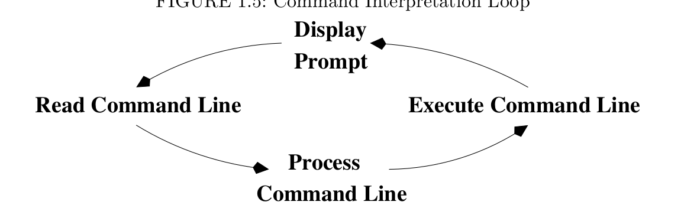
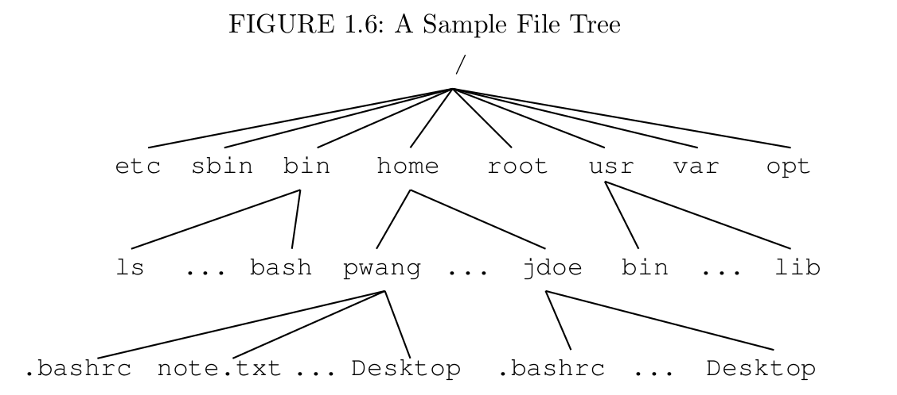
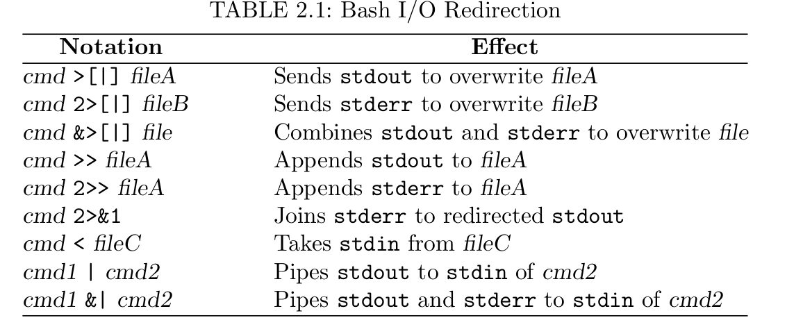
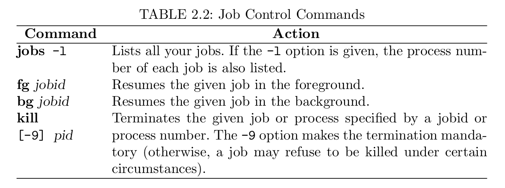

# Linux hardware knowledge

It is a good practice to know the hardware components of your linux system is running.

## uname

print out the system information
`uname -s` print out the shell information
`uname -n` print out the uname
`uname -v` print the kernel version
`uname -r` print out the kernel release
`uname -m` print out the hardware name
`uname -a` print out all the information


## `lshw`

`lshw` gather vast information about your hardware information, such as cpu, disk, memory, usb controllers. The information provided by `lshw` gather from different `/proc` files.


## `lscpu`

`lscpu` shows the information abouth cpu. The information is from `sysfs` and `/proc/cpuinfo`

## `lsblk`
Check hard disk information

* `lsblk -a` list all the blocks

* Note, `sda` and `sdb` just corresponds to two different physical disks. If you have a third disk, it would be `sdc`.. 

## `lsusb` 
List the information about SUB controllers.

## `lspci`

PCI (Peripheral Component Interconnect) devices may include usb ports, graphics, network adapter etc.

* `lspci -t` list the information in a tree format.
* `lspci -v` list the detailed information.

## `scsi` and `sata`

`scsi` (Small Computer system interface) and `sata` (serial advanced technology attachment) 

* `lsscsi -s` shows the device size.


## `hdparm`

list the information about sata devices informaton

* `haparm -g` print out the geometry interms of the cylinders, heads, sectors, size...

## `fdisk`

print linux file system information

## `dmidecode` 

extract hardware information by reading data from DMI tables


1. `sudo dmidecode -t memory`  print information about memory
2. `sudo dmidecode -t system` print out the information about system
3. `sudo dmidecode -t bios` print out information about bios
4. `sudo dmidecode -t processor` print out information about processor


## summary

Most of these commands use files in `/proc` to extract the system information.

## `dpkg`
`dpgk` queries, installs, removes, and maintains Debian software package and their dependencies.

* `dpkg -i` installs the package
* `dpkg -r` removes the package. 

## `apropos`
When you are not sure of the exact name of a command

## `chmod`
change mode for files, example

* `chmod go-rwx` remove `rwx` for group and other.
* `chmod go+rwx` add `rwx` for group and other.

## `ps`
A process is an executing program identified by unique PID (process identifier). To to see information about your system, with their associated PID and status, type


## `sleep`
wait sometime before command line to prompt, example

* `sleep 10` will wati 10 seconds.

## `ctrl+z` 

Suspend the process and then `bg` to make it background

## `jobs`

When a process is running, background or suspended, it will be entered into a list with job number,

* `bg %jobnumber` to background a job
* `fg %jobnumber` to foreground a job

**Note: job number is different from PID**
**Note: Don\'t forget `%`**

## `kill`

kill the job nubmer or PID

* `kill %jobnumber` or `kill PID`

## `diff`

* `diff` compares the contents of two files and display the differences. Suppose you have a file called file1 and **file2**. To see the difference
* `diff file1 file2`
* `<` denotes file1 and `>` denotes file2

## `find`

search through directory for files with a given name, date, size..

* `find . -iname "*txt" 
* `find . -size +1M -ls`

## `history`

Each command is given a number according to the order it was enterd.

* `history` list all the command history
* `!!` exectue the last command
* `!-3` execute the third most recent command
* `!5` execute the 5th command in list
* `!grep` recall the last command starting wth grep 
* `set history=100`, increasing the history buffer


## Variables

There are two categories, environment variables (upper case) and shell variables (lower case).

* OSTYPE, USER, HOME, HOST, ARCH, DISPLAY, PRINTER, PATH
* `setenv` set the ENVIRONMENT variables, display using `printenv` or `env`. And unset use `unsetenv`
* shell variables, `history`, `cwd`, `home`, `path` and `prompt`. `set` is used to set or display shell variable

## pip problem

* `&` put program background.
* `;` push multiple commands in a single line.
* `&&` The second command would execute only if the first one succeeds.
* `||` The second command would execute only if the first one fails.
* `!` all except. `rm -r !(\*html)` would delete all the files except html.
* `|` The pip operator, the output of the first command is the input of the second command.
* `$()` is the same as ````

## [introduction of subdirectories](https://www.linux.org/threads/in-linux-everything-is-a-file.4251/)
* `/dev` There are devices that your system will uses or can use.
* `/root`
* `/sbin` has frequently used programs.
* `/tmp` stores temporary files.
* `/var` is a directory for certain files that may change size.
* `/lib` is for library files. Normal error: can\'t find shared library
* `/home` is user directory.
* `shutdown -h`  
* `touch -t 05070915 my_report.txt` change the time and date of files.
* `who` checks who is working on the computer. (whoami).
	* `whatis` shows a command instruction.
* `tee` write what appears on your screen into a file.
* `date, cal, which, whereis whatis`

## File system
* `Ext2` is like Unix file system. It has the concepts of blocks, inodes and directories.
* `Ext3` It is backward compatible with ext2 file system.
* `Isofs` used by CDROM file system.
* `Procfs` acts as an interface to internal data structures.
* `mount` and `umount`.
	* Example: `mount -t iso9660 /dev/hdb /cdrom` (If cdrom doesn\'t exist, create it)
	* Example: `mount -t vfat /dev/hda1 /mnt`
	* Exmaple `umount [mount point]`
* `du -hsa`
* `adduser` add users to system.

## [Repository](https://help.ubuntu.com/community/Repositories/CommandLine)
This section introduces how to manage software repositories.

1. Ubuntu uses `apt` for package management. `apt` stores a list of repositories or software channels in the file 
`/etc/apt/sources.list`
and any files with suffix .list under the directory
`/etc/apt/sources.list.d/`

2. By editting these files from the command line, we can add, remove, or temporarily disable software repositories. 
    * Start with `#` are comments 
    * **deb**:, these repositories contain binaries or precompiled packages. These packages are required by most users.
    * **deb-src**:, these repositories contain the source code of the packages. Useful for developers.
    * **[http://archive.ubuntu.com/ubuntu](http://archive.ubuntu.com/ubuntu)**: The URI (Uniform Resource Identifier), in this case a location on the internet.
    * **saucy** is the release name or version of your distribution.
    * **main&restricted** are the section names or components. There can be several section names, separated by spaces.
    * **add-apt-repository**. Example "sudo add-apt-repository "deb http://us.archive.ubuntu.com/ubuntu/ saucy universe multiverse"
    * **lsb_release -sc** to find out the release. 
    * Add other repositories at the end of sources.list file
    * **PPA (personal package archive)**. Use add-apt-repository 
        1. The command upates sources.list or files under sources.list.d
        2. If a public key is required and available it is automatically downloaded and registered.
        3. Should be install by default.
3. Suggestions. 
    1. always backup sources.list
4. Different repository
    * Universe and multiverse repositories
    * Partner repositories
    * Other repositories
    * personal package archive (ppa repositories)

## [Bash programming](https://www.linux.org/threads/programming-with-bash.4234/)
`#1` (shebang) are followed with the path to Bash interpreter. (Example: `#!/bin/bash`)

**When you use a command as a variable, it must be put inside backticks(``) or ($()).**

ENVIRONMENT VARIABLES EXAMPLE:
```
echo "You are user $UID on $HOSTNAME".
echo "Your home directory is $HOME".
echo "$HOSTNAME is running on $OSTYPE".
```
### Interactive script
```
#!/bin/bash

echo -n "Enter the name of a city: "
read CITY
echo -n $CITY is "
case $CITY in 
London | Paris | Berlin | Rome) echo -n "in Europe";;
"New York" | Chicago | Washington) echo -n "in USA";;
Tokyo | Beijing | Bangalore) echo -n "in Asia";;
*) echo -n "some place - but I don't know where";;
esac
```

## [Mastering Linux](http://ketabnak.com/redirect.php?dlid=66085)

### Linux system
The linux system mainly consists of two parts: a *kernel* and a set of commands and applications.
* The *kernel* deals with central functions, including concurrent program execution, memory management, input/output, file service, and network service.
* Commands and applications supply other operations such as Shell, language compilers, text editor, etc.
* *Shell* is a special program in Linux, which is a command interpreter that allows users to type commands and run programs. 

### LAN (local area network)

### [GNONE vs KDE](http://www.differencebetween.info/difference-between-kde-and-gnome)
**GNOME** and **KDE** are Linux desktop systems.
* **gnome-terminal**(GNOME)** vs. **konsole**(KDE)
* A terminal window emulates a character-based computer terminal and allows you to use Linux through a *command interpreter* called the *Shell*.
* *Command interpreter* == *Shell*. The *Shell* indicates its readiness to take your commands by displaying a *prompt* at the beginning of a line.
* You need a terminal window to use a *Shell*, which is your CLI to interact with Linux.
* THe *Shell* displays a prompt to signal that it is ready for your next command, which it then interprets and executes.
    * `echo $0` print out the name of the shell you are using.
* Command syntax (separated by space)
    * *command name*
    * *argument*
    * *;* for multiple commands in the same line.
    * **command-name** [ *option* ] ... [ *args* ] ...          # backets are used indicate *optional* parts of the a command. THe brackets are not needed.
    * Example: `ls --help` for most useful commands display. 
    * 
* `echo` examine the value of a *Shell variable*.
* `uname -all` identify the operating system version running on your computer.
* `who` list the current users singed in on the system.
* `.file` are hidden files, which are usually are standard operating systems or application files for configuration or other prescribed purposes.
* `.bash_profile` is standard file for the Bash Shell.
* `passwd` change the password.

### File structure
Here is file structure image.




* file name shoud avoid white space and any leading hyphen (-).
* **u** (the owner or creater of the file)
* **g** (Members in the file\'s group)
* **o** (others)
* **r** (read permission, first bit)
* **w** (write permission, second bit)
* **x** (Execute permission, third bit)

### directory
A user needs the **x** permission to enter a directory, the **r** permission to list filenames in the directory, and the **w** permission to create/delete files in the directory.
* `chmod o-w filename` remove write permission for others.
* `chmod a+x filename` add execute permission for all the users.
* `chmod u-w+x filename` remove write permission and add execute permission for user.
* `chmod a=rw filename` reset read and write permission for all users.

### [Consulting Linux Documentation](http://tldp.org)
* FAQ
* Topic-specific step-by-step instructions (HOWTOs)
* Two kinds of commands.
    * Built-in Shell commands that are subroutines in the Shell.
    * regular commands that are initiated as jobs controlled by the Shell.
    * user-supplied arguments are shown in *italics*.
    * Optional arguments are shown in square bracket [].
    * Possibly repeated arguments are indicated by cllipses (...).
    * Example: `ls -l -t /home/gxdai /home`
* `PATH` defines the *command search path*, a list of directories containning executable commands.
* `/usr/local/bin` where you install extra applications to your Linux and a `bin` in your home directory.
* A special `.` is often placed at the end of the search path to enable you to invoke any command in current directories. `export PATH=$PATH:.`
* `which command_name` displays the alias/function or the full path of the executable file.
### Standard input and output

* File descriptor 0, *standard input* or **stdin**.
* File descriptor 1, *standard output* or **stdout**.
* File descriptor 2, *standard error* or **stderr**.
* **Redirection** `>, <, |`
* `>>` **append**
* `command > file 2>&1`, (**stderr** joins **stdout** into file)
* `command > file1 2>file2` (send to different files).
* `cat > file`. All the content you typed on the keyboard will be in file. CTRL+D to end.

### Pipe
Redirecting the output of one program as input to another program.
* `ls -lt | more` pipes the standard output of `ls -lt` to the standard input of **more**.
* Difference between `|` and `>`.
    * The receiving end of a pip `|` is always another program and the receiving end of `>` is always a file.
    * 
* Job control commands. 

* Command history


* **alias**: `alias name=value ...` **Don't forget quotes**

### Graphic command
* **evince** for pdf, tiff and dvi.
* **eog** - The Eye of gnome image viewer. Such as bmp, gif, jpeg, png, svg and tiff
* **ImageMagick(display)** for editting raster and other image formats.
* **Screen Capture(import)** for capturing visual screen.

### tar command
```
tar -xvf archive.tar -C target_directory
```
extract file to target directory

### .a vs .so
There are two types of Linux library. **Static library (.a)** and **Dynamically linked object library(.so)**

### `\`ls\`` == `$(sl)`

### `$?` holds the value of the last command you run.
### `return 0` if the command is succeed.
