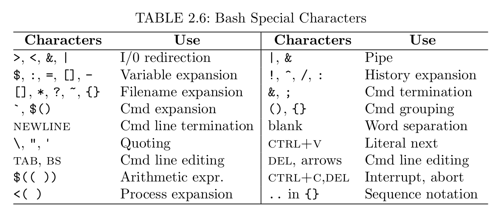

# Interactive Use of the Shell
## 2.7 Bash Shell Expansions
Each command line undergoes a number of transformations before it is executed by the Shell. These transformations are called *Shell expansions*. 
* `ls -l \*html`: *filename expansion*.

* Command history


### Brace and Tilde Expansions (Page 60)
*Brace expansion* provides a shorthand for similar words on command line, example:
* `nano memo{Sep,Oct}2011.txt` becomes `nano memoSep2011.txt memoOct2011.txt1
* `ls chap{0..3}.pdf` becomes `ls chap0.pdf chap1.pdf chap2.pdf chap3.pdf`. (**\.\.** works for numbers and single letter)
* `~` expands the user's own home directory, `~+` the current directory, `~-` the previous directory.
### Variable Expansion

`var=value` (sets variable value). **NO white space is allowed immediately before or after the equal sign (=)**. For example
```
ldir=/usr/local

echo $ldir
```
This will print out `/usr/local`

IF there are blank (proceded by a backslash \\). `unset var` to remove any variable *var*.


The *extent* of a variable name can be delineated by braces ({ and }). For example
```
x=abc
echo ${x}de
echo $xde
```
The results are different
```
abcde
xde
```

`$(( ... ))` are used to perform arithmetic operations (including \+ \- \* \/ \+\% \*\* \+\+ \-\-). For example
```
count=7
echo $(( 3*count ))
echo $(( count%5 ))
echo $(( count++ ))
```
* `set` display all variables and functions.
* `declare` display all variables and functions.
* ` declare` display all functions.

### Command Expansion
Command expansion makes it possible to use the standard output of a command as a string of words in another command. Either `$(command)` or `\`command\`` can be used for command expansion. For example,
`dir`=$(pwd)`

Another example `file1=$dir1/test.c`

### Process Expansion
Bash extends the ideas of I/O redirection one step further by allowing the notation
```
<(command *args*..)
```
to be used where a **filename** argument is expected for a command. Thus, the notation `<(...)` produces a temporary file, with the output produced by the command line inside, which can be given to anther command. For example
```
nano <(ls -l -F)
```
Another example
```
diff <(ls -F /usr/bin) <(ls -F /usr/bin.old)
```

### Filename Expansion
*filename pattern* and *glob pattern* is used in a command line. A pattern may match simple filenames as well as full or relative pathnames. If a pattern does not match any file, then it stands for itself and is not expanded. `*, ?, []`. 
* `\*` matches any sequence of zero or more characters. For example
```
ls -l *.c
```
```
ls -l ../*.c
ls ~/Pictures/2011*/*jpg
```
* `?` matches any single character
* `[..]` matches any one of the characters contained between \[ and \] (*range pattern*). For instance `a[rxz]b` matches `arc, axb, azb`. `chapter[0-9]` matches `chapter0, chapter1...`
* `[^..]` matches any one of the characters not contained between \[ and \] (*range pattern*). For instance `a[rxz]b` matches `arc, axb, azb`. `chapter[0-9]` matches `chapter0, chapter1...`
* `[:class:]` Specifies a *class* of characters, **in a range pattern**. The class can be **alnum**, **alpha**, **digit**, **lower** and **upper**. Example
    ```
    ls [[:digit:]]*
    ```
    The pattern matches all files whose name starts with a digit.

### Bash Built-in Commands
`help` list all the Bash built-in commands. Bash maintains a *directory stack*. By default, it contains the current working directory. The built-in **pushd** changes to the given directory and push it onto the stack. The built-in **popd** changes to the top directory on the stack after popping it off the stack.

The Bash built-in command **source** ( or simply a dot .) A file of Shell commands is known as a *Shell script*.
```
source script
. script
```
#### [Explain between source file vs. ./file](https://superuser.com/questions/176783/what-is-the-difference-between-executing-a-bash-script-vs-sourcing-it)
The differences are:
* When you *execute* the script, you are opening a new shell, type the commands in the new shell, copy the output back to the current shell, then close the new shell. Any changes to environment will take effect only in the new shell and will be lost once the shell is closed.
* When you *source* the script you are typing the commands in your current shell. Any changes to the environment will take effect and stay in your current shell.

**Use source if  you want the script to change the environment in your currently running shell. Use execute otherwise.**

### Shell Variables
Here is a list of oether special variables
* `USER, PWD, OLDPWD, HOME, SHELL, HISTSIZE, HOSTSIZE, PATH, CDPATH`

### Environment of a Program
The execution environment of every process consists of two parts: user defined and systerm defined. `USER, PWD` are determined by the system and passed on from your Shell to any invoded applications; whereas quantities

Command execution will create a *child process* and transmits to it an execution environment
* Standar I/O and otther open files.
* Current working directoy
* File create mask.
* Environment variables already in the Shell's own execution environment and additional ones defined by the user.

Instead of `export` and `unset`, you add variables to the environment on a per-command biasis. When you issue any regular command, you can set variables in front of the command name to add them the *environment passed to the command* without affecting the environment of the Shell itself. For example:
```
YEAR=2011 bash
```
The subshell will have an environment variable **YEAR** set to the value 2011 while your Shell remains unchanged.

**In bash, any variables can become environment variables by the `export` command. However it is a good practice to use all uppercase names for environment variables.**

### Example of Bash Usage
#### Customized prompt
The shell displays a prompt when it is ready for your next command. In GNU Linux, the default Bash prompt `PS1='\s-\v\$'`, meaning *-Shell_base_name-version$*. For example,
```
-bash-3.2$(#: for root)
```
### Shell Special Characters and QUoting

In fact, any character on the keyboard that is not alphabetic or numeric is probably special in some way. Notable exceptions are the period (.) and the underscore (_).

**Spetial character is differnt from regular character**


#### Quoting in Bash
Bash provides the backslah (\`) escape character, sinle quotes ('...'), double quotes ("..."), and ANSI-C quotes ($'...'). For example,
```
vi f\&g.c
grep US\$ report.*
```
The character & and $ lose their special meaning when preceded by \. Instead they stand for literal characters themselves. If a space or a tab is preceded by a \, then it becomes part of a word. If the NEWLINE is preceded by a \, it is equivalent to a blank. Thus, using a \ at then of a line continues the Shell command to the next line. To get the \ character without escapint the next character, use \\.

**A pair of sinle quotation marks (') the entire string of characters enclosed.
```
echo 'a+b >= c*d'
cat /usr/pwang/'my>=.c'
echo It\'s a good day
```

Single Quote
* All quoted characters, including \, are taken literally. Thus, excaping the single quote with backslash within a single-quoted string does not work.
* The quoted string forms part or all of one word.


Sometimes it is desiirable to allow certain expansions within a quoted string. Quoting with double quotation marks (") serves this perpose. A pair of double quotation marks functions the same as a pair of singel quotation marks with three differences:
* First $ and ! works in inside double quotation marks.
    ```
    echo "Your host name is $HOSTNAME"
    echo "Last command is !-1"
    ```
    work as expected.

* Normally, the output of a command expansion, via $(..) or `...`, is broken into seprate words at blanks, tabs, and NEWLINEEs, with null works being discarded; this text then replaces the original backquoted string. However, 
    ```
    date=`date`
    datestring="`date`"

    echo $date
    echo $datestring
    Fri Apr  6 09:40:11 +04 2018
    Fri Apr 6 09:40:11 +04 2018     # only one space between words
    ```
* In double quotating marks, \\ escapes $, ', ", or NEWLINE. In addition \! (history command).
* $'str' allows you to use ANSI-C escape characters in *str*.

### Simple functions
```
function fnName () {
    conmmand 1; 
    command 2;
    command 3;
    ...
    command n;
}
```
**alias** doesn't work inside a function.

**Each command inside a function must be terminated by a semicolon.**

[Difference between $@ and $\*](https://unix.stackexchange.com/questions/129072/whats-the-difference-between-and). refer to all the arguments in the function call.
* $\* is a single string, $@ is acutall array. Here is the difference:
    ```
    \#!/bin/bash
    echo "Using \"$*\":"

    for a in "$*"; do
        echo $a
    done

    echo -e "\nUsing \$*:"
    for a in $*; do
        echo $a
    done


    echo -e "\nUsing \"$@\\":"
    for a in "$@"; do
        echo $a
    done

    echo -e "\nUsing $@:"
    for a in $@; do
        echo $a
    done
    ```
    run `./test.sh one two "thre foour".
    * case 1 ("$*"): the parameters are treated as one long quoted string. `one two three four`.
        ```
        Using "$*"
        one two three four
        ```
    * case 2 ($*): The string are broken into words by `for` loop. 
        ```
        Using $*
        one
        two
        three
        four
        ```
    * case 3 ("$@"): This treats each element of $@ as a quoted string.
        ```
        Using "$@"
        one
        two
        three four
        ```
    * case 4 ($@): This treats each element as an unquoted string, so the last one is split 
        ```
        Using $@
        one 
        two
        three
        four
        ```

### Exercise
1. `cd` is built into the Shell, why can't be implemented as a regular program?
    * The `cd` commands modifies the "current working directory"", right? 
    * "Current working directory" is a property that is unique to each process.
    * So, if `cd` was a program it would work like this:
        1. `cd foo`
        2. The `cd` process starts
        3. The `cd` process changes the directory for the `cd` process
        4. The `cd` process exits.
        5. Your shell still has the same state, including current working directory, that it did before you starts.

    
    
