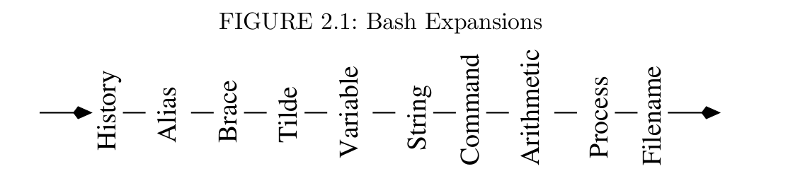
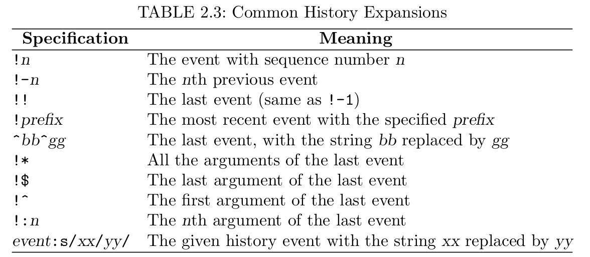

# Interactive Use of the Shell
## 2.7 Bash Shell Expansions
Each command line undergoes a number of transformations before it is executed by the Shell. These transformations are called *Shell expansions*. 
* `ls -l \*html`: *filename expansion*.

* Command history


### Brace and Tilde Expansions (Page 60)
*Brace expansion* provides a shorthand for similar words on command line, example:
* `nano memo{Sep,Oct}2011.txt` becomes `nano memoSep2011.txt memoOct2011.txt1
* `ls chap{0..3}.pdf` becomes `ls chap0.pdf chap1.pdf chap2.pdf chap3.pdf`. (**\.\.** works for numbers and single letter)
* `~` expands the user's own home directory, `~+` the current directory, `~-` the previous directory.
### Variable Expansion

`var=value` (sets variable value). **NO white space is allowed immediately before or after the equal sign (=)**. For example
```
ldir=/usr/local

echo $ldir
```
This will print out `/usr/local`

IF there are blank (proceded by a backslash \\). `unset var` to remove any variable *var*.


The *extent* of a variable name can be delineated by braces ({ and }). For example
```
x=abc
echo ${x}de
echo $xde
```
The results are different
```
abcde
xde
```

`$(( ... ))` are used to perform arithmetic operations (including \+ \- \* \/ \+\% \*\* \+\+ \-\-). For example
```
count=7
echo $(( 3*count ))
echo $(( count%5 ))
echo $(( count++ ))
```
* `set` display all variables and functions.
* `declare` display all variables and functions.
* ` declare` display all functions.

### Command Expansion
Command expansion makes it possible to use the standard output of a command as a string of words in another command. Either `$(command)` or `\`command\`` can be used for command expansion. For example,
`dir`=$(pwd)`

Another example `file1=$dir1/test.c`

### Process Expansion
Bash extends the ideas of I/O redirection one step further by allowing the notation
```
<(command *args*..)
```
to be used where a **filename** argument is expected for a command. Thus, the notation `<(...)` produces a temporary file, with the output produced by the command line inside, which can be given to anther command. For example
```
nano <(ls -l -F)
```
Another example
```
diff <(ls -F /usr/bin) <(ls -F /usr/bin.old)
```

### Filename Expansion
*filename pattern* and *glob pattern* is used in a command line. A pattern may match simple filenames as well as full or relative pathnames. If a pattern does not match any file, then it stands for itself and is not expanded. `*, ?, []`. 
* `\*` matches any sequence of zero or more characters. For example
```
ls -l *.c
```
```
ls -l ../*.c
ls ~/Pictures/2011*/*jpg
```
* `?` matches any single character
* `[..]` matches any one of the characters contained between \[ and \] (*range pattern*). For instance `a[rxz]b` matches `arc, axb, azb`. `chapter[0-9]` matches `chapter0, chapter1...`
* `[^..]` matches any one of the characters not contained between \[ and \] (*range pattern*). For instance `a[rxz]b` matches `arc, axb, azb`. `chapter[0-9]` matches `chapter0, chapter1...`
* `[:class:]` Specifies a *class* of characters, in a range pattern. The class can be **alnum**, **alpha**, **digit**, **lower** and **upper**. Example
    ```
    ls [[:digit:]]*
    ```
    The pattern matches all files whose name starts with a digit.
