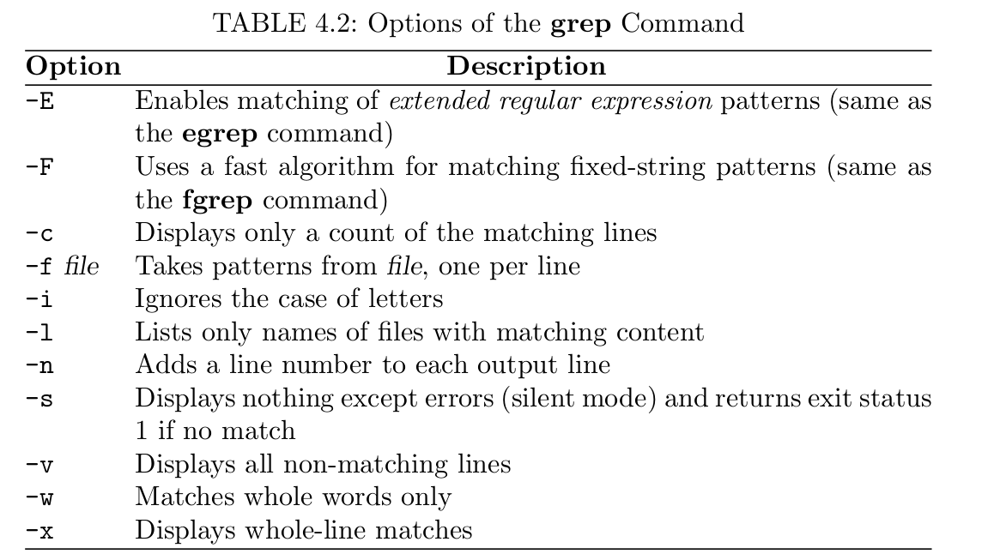

# Chapter 3 Filters and Regular Expression

Many usefule *pipelines* are presented in this chapter. *Regular expression* provide standard ways to specify *patterns* in textual data for applications such as **grep**, **sed/vi**, and **awk**.

## Leading and trailing lines: `head` and `tail`
The command **head** and **tail** are available for displaying the leading and trailing  lines of a file, respectively.
```
head [-k] [file ...]
```
```
tail [-k] [file ...]
```
## Character Translation: tr
The command `tr1` copys standard input to standard output, subtituting or delete specified characters. For example,
```
tr A-Z a-z <file1> file2
```
Creates *file2* as a copy of *file1* with all uppercase letters translated to the corresponding lowercase ones. Another exammple:
```
tr TAB % <file1> file2
```
TAB is CTRL+V. This command will allow you to see TAB in *file1* as % in *file2*.
```
tr string1 string2
```
## TAB Expansion
**expand**          (substitudes spaces for tabs)
**unexpand**        (substitudes tabs for spaces)
Example
```
expand 6 < file
```
Replace each TAB in *file* for spaces, assuming that TAB stops are 6 spaces apart (default 8).

## Folding Text lines
**fold**
```
fold < file
```
The **fold** will break up long lines yb insertting a NEWLINE character where necessary. The default is to limit lines to a length of 80 characters.
* f     treats all uppercase letters as lowercase letter
* n     sort by increasing magnitude
* r     reverses the sense of comparisons and sorts lines in reverse order.

Example:
```
ls -l | sort -n --key=5,6.0
ls -l | sort -nr --key=5,6.0
```
sort the file by increasing byte count.

## grep


Generally speaking, the **grep** command is used either to obtain lines containing a specific pattern or to obtain the names of files with such lines.

## Regular expression


For example, in **vim**, you can search "step [1-9]" for any step
```
/step\ [1-9]
```


Quoting a character that does not need quoting usually causes no harm.

## Extended regular expression
**grep -E or egrep**

The precedence of operator used for extened regular expression is (), [], ", +, ?. It is safest to always enclose the entire pattern in a pair of single quotation marks.

```
grep '\-s`			(match -s; the \ prevents -s from becoming a command options)
grep -i '^linux'		(matches linux at the front of a line, ignoring case)
grep 'ch[0-9]*'			(matches ch followed by any number of digits)
egrep \.html?\>			(matches a word ending in .htm or .html)
egrep '\<\w+\.docx?' 		(matches any word followed by .doc or .docx)
```
## A Stream Editor
The **sed** program is a filter that uses line editting commands to transform input lines, from **stdin** or a file, and produces desired output.


Example:
```
sed script [ file ] ...
```

Example:
```
sed 's/Web site/websit/' chapter1
sed 's/Web site/website/g' chapter1
```
The first command reads the input file *chapter1*, substitutes(s) any first occurence of **Web site**, and outputs all lines, changes or not, to the standard output (only the first instance in the line will be replaced). To replace all occurences, use **g**.

If no file is specified, **sed** edits from **stdin**. The single quotation marks around script to prevent the Shell interpretting any special characters in the script:
`-f` for script file
```
sed -f double file
```
where double contains
```
s/$/\
/
```
This will add an empty line after each line, producing a double-spaced output. In **grep**, $ means the end of a line.
### Editting a range of lines
General form
```
[address1], [address2] action [args]
```
* No address - The given action applied to every lien.
* One address - The action applies to every line matching that address
* Two address - The action is applied repeatedly to the next set of lines beginning with a line that matches address1, up to and including the first line that matches address2
For example
```
sed '/^$/d' file
sed '/[ 	]*$/d' file
```

Two address action
```
set '/<table .*>/,/<\/table>/d' try.html > notables.html
```
The delete line action action **d** si applied to all table lines.

```
sed -n '12,20p' file
```
Only outputs lines 12-20 of the given file
```
set '/<table .*>/,/<\/table>/p' try.html > tables
set '/<table .*>/,/<\/table>/!d' try.html > tables
```
(!) reverses the senses of the specified address. It applies specified action to every line except the lines matching the given address.
## Building piplines

applies the action **d** to each line matching the single address `/^$/`, an address obtained by searching for the next empty line. The output will be the same as file, but with all empty lines deleted.


 
