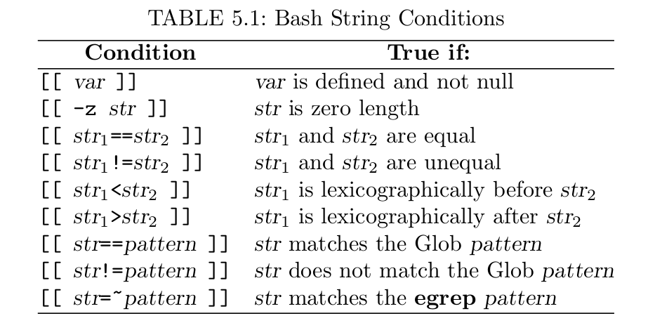

# Shell Scripts
## source script vs. bash script
The first command is executed in the current shell. The second command is executed in a new subshell.
```
#!/bin/bash

## consults myContactList

grep -i "$1" ./myContactList
```
`$n` denotes the n-th *positiional parameters*.
If n is bigger than 9, use `${n}`. 
`$* or $@` is set the list of arguments given on the command line.
`$#` is set to the number positional arguments.
*termlist* refers to zero or more blank separated words.
## SHell script Execution
A shell script of a sequence of shell built-in commands and regular commands separated by *NEWLINE* or (;).
## `for`
The `for` is used to execute a set of commands repeatedly. The general form is 
```
for var in wordlist
    do commandlist
done
```
The breakline is needed unless you use (;).
```
for var in wordlist; do commandlist; done
```
## $\* vs $@
```
somecmd a b "c d"
```
The $\* and $@ will both be the list `a b c d` with four words. The "$\*" will make it one word, wherease "$@" makes it three words, `a, b and "c d"`. 
**It is important to understand the difference**

## if else
```
if testCond
    then
        conmmandlist1
    else
        conmmandlist2
fi
```
The test expression `[[ -f file ]]`, known as an *extened conditional*.

In a test expression, the **space** after `[[ and the SPACE before ]]` are part of the conditional notation.
```
if expr1
    then
        commandlist1
elif expr2
    then
        commandlist2
else
        commandlsit3
fi
```        

## Test expression and Exit status
### Exit status
In Linux, a command indicates whether it has succeeded by providing an integer *exit status* to its invoking environment. A zero exit status means okay, and non-zero means error. **$?** for exit status.

In a shell script, use the built-in command **exit** n to terminate executation.

### Test Expressions
Test expression
* A regular or built-in command
* An extended conditional expression [[ ]]
* A numerical expression (( )), with 0 being false and non-zero being true.
* ( test exp ), used () for precedence grouping.
* ! test exp, "logic not" 
* exp1 && exp2, "logical and" of the two expressions
* exp1 || exp2, "logical or" of the two expression.



The extended conditions also supports numerical tests
```
[[ arg1 rop arg2 ]]
```
to compare to integers arg1 and arg2 with a relational operator rop
```
==, !=, <, >, -le, -ge
```


