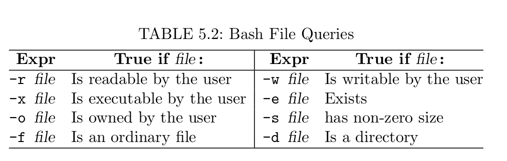
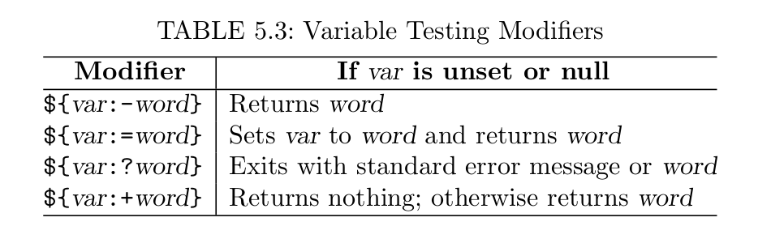

# Shell Scripts
## source script vs. bash script
The first command is executed in the current shell. The second command is executed in a new subshell.
```
#!/bin/bash

## consults myContactList

grep -i "$1" ./myContactList
```
`$n` denotes the n-th *positiional parameters*.
If n is bigger than 9, use `${n}`. 
`$* or $@` is set the list of arguments given on the command line.
`$#` is set to the number positional arguments.
*termlist* refers to zero or more blank separated words.
## SHell script Execution
A shell script of a sequence of shell built-in commands and regular commands separated by *NEWLINE* or (;).
## `for`
The `for` is used to execute a set of commands repeatedly. The general form is 
```
for var in wordlist
    do commandlist
done
```
The breakline is needed unless you use (;).
```
for var in wordlist; do commandlist; done
```
## $\* vs $@
```
somecmd a b "c d"
```
The $\* and $@ will both be the list `a b c d` with four words. The "$\*" will make it one word, wherease "$@" makes it three words, `a, b and "c d"`. 
**It is important to understand the difference**

## if else
```
if testCond
    then
        conmmandlist1
    else
        conmmandlist2
fi
```
The test expression `[[ -f file ]]`, known as an *extened conditional*.

In a test expression, the **space** after `[[ and the SPACE before ]]` are part of the conditional notation.
```
if expr1
    then
        commandlist1
elif expr2
    then
        commandlist2
else
        commandlsit3
fi
```        

## Test expression and Exit status
### Exit status
In Linux, a command indicates whether it has succeeded by providing an integer *exit status* to its invoking environment. A zero exit status means okay, and non-zero means error. **$?** for exit status.

In a shell script, use the built-in command **exit** n to terminate executation.

### Test Expressions
Test expression
* A regular or built-in command
* An extended conditional expression [[ ]]
* A numerical expression (( )), with 0 being false and non-zero being true.
* ( test exp ), used () for precedence grouping.
* ! test exp, "logic not" 
* exp1 && exp2, "logical and" of the two expressions
* exp1 || exp2, "logical or" of the two expression.


The extended conditions also supports numerical tests
```
[[ arg1 rop arg2 ]]
```
to compare to integers arg1 and arg2 with a relational operator rop
```
==, !=, <, >, -le, -ge
```
## shift
The built-in command
```
shift
```
left shifts $2 to $1, $3 to #2, etc. In general
```
shift n
```
### case
```
case (str) in
    pattern1)
        commandlist1
        ;;
    pattern2)
        commandlist2
        ;;
    ...
esac
```

## while
In addition to the **for** command, the **while** and **until** commands control iteration with an arbitrary condition.
```
while testExp
do
    commandlist
done
```
For an infinite loop, use the Bash built-in command (:) (colon) as testExp. The **:** does nothing other than expand arguments and give a 0 exit status.

```
[[ "$go" == y\* ]]
```
For anything starts with y

## Numerical Expressions
Since Shell variables are string-valued. We need to use the *arithmetic expansion* 
```
$(( arith-expr ))
```
The shell built-in **let** could also be used to perform arithmetic operations.
```
let exp1 exp2
```
Comparison
```
if (( $a > $b ))
```
if a is greater than b
## break and continue
`break` is used inside `for, while, until`. When `break` is executed, control shifts to the first line after the end of the nearest enclosing iteration. Similarly, `continue` skips to the next iteration. Within nested loops, `break` and `continue` can take an optional integer argument (1, 2, 3, etc) to break or continue out of the *n*-th level of nested loops.

## File Queries
`help test` to get a complete list for file query.
For example
```
if [[ -e $file && -f $file && -w $file ]]
then
    cat $1 >> $file
else
    echo "access problem for $file"
fi
```


## variable
There are three different variables
1. Positional variables ($1, $2, ...) and special variables ($0, $#)
2. Environment variables such as DISPLAY and SHELL
3. ordinary variables and arrays of your own choosing.
To assign a variable
```
var=value
```
SHell expansion and evaluation are performed on `value`, and the result is assigned to the given variables.

* if value is omitted, then the variable has value null
* variable attributes can be declared:
```
declare -i var1 var2            (holding integer values)
declare -r var1 var2            (read-only)
declare -a arr1 arr2            (arrays)
declare -x var1 var2            (exported to the environment)
```
To remove a variable `unset var`.

## Array
To declare an array variable
```
declare -a var
```
However, it is not necessary. For example, to create an array *fruit*, you can use the assignment,
```
fruits=("red apple" "golden banana")
```
or equivalently
```
fruits[0]="red apple"
fruits[1]="golden banana"
```
Bash array is 0-indexing. However, the indices do not have to be consecutive.

## Variable modifier
Bash provides notations to make variable usage even more flexiable for advanced scripting. The value obtained from a variable can be more modified before it is introduced into a command or expression
1. Specify the value returned in case a variable is unset (does not exist) or null
2. Return a substring of the variable value.

For example:
```
file=${1:?"usage: $0 filename"}
```
### substring
```
file=/tmp/log.jpg
${file:3}           ## is p/log.jpg
${file:3:5}         ## is p/log
${file#*/}          ## is tmp/logo.jpg
${file##*/}         ## is logo.jpg
${file%/*}          ## is /tmp
${file%.jpg}        ## is /tmp/logo
${file%\.*}         ## is /tmp/logo
${file##*\.}        ## is jpg
```
When applied to the positional parameters ($\* and $@) or arrays (${array[\*]} and ${array[@]}), the first modifier produces a list of words from subarray. Whereas, the other modifierin the table each produces a list of words by acting on each value in a given array.
```
picture=(a.jpg b.jpg c.jpg d.jpg)
echo ${picture[*]:2}        # c.jpg d.jpg
echo ${picture[*]%.jpg}     # a b c d
names=( ${picture[*]%.jpg} )        ## is array (a b c d)
```
function latex ()
{
    /usr/bin/pdflatex ${1%.tex}.tex && \
    /usr/bin/acroread ${1%.tex}.pdf 
}
```
The modifier `${1%.tex}` makes it possible to use either of the following two ways to invoke **latex** function.

## The Here documents
It is possible to include a script input that is normally entered interatively. In Shell script terminalogy, this type of input is known as a *here document*. For example:
```
command << word
zero or moe
lines of input texts
word
```
The delimiter word is not variable, filename, or command substitute.
## More on functions
* A bash function is defined without any named parameter.
* Any arguments passed in a function call are access from with that function using the *positional parameters* $1, $2
    ```
    function compare()
    {
        local str1="$1"
        local str2="$2"
        if [[ $str1 == $str2 ]]
            then echo 0;
        elif [[ $str1 > $str2 ]]
            then echo 1;
        else
            echo -1;
        fi
    }
    compare "apple" "orange";
    ```
* The keyword *local* declares variables local to the function (not accessible from outside the function)
* Display array
    ```
    function displayArray()
    {
        echo -n "(";
        for el ## iteration over..
            do echo -n " \"$el\" ";
        done
        echo ")";
    }
    displayArray "${prime[@]}"
    ```
* Except passing by value, it is also possible for passing by reference.
    ```
    function addOne()
    { let $1+=1; }
    n=12;
    addOne n;
    echo $n;
    ```
    When we use n, instead of $n, in the call to addOne, the $1 inside the function evaluates to the symbol n.
* By implementing a script as a function, you can place it in your Shell initialization file (.bash_profile for example) and make it part of your Shell.
* ! (logic not)
* This works because the next operand of || (logical or) will be evaluated only if the previous operand is false.
