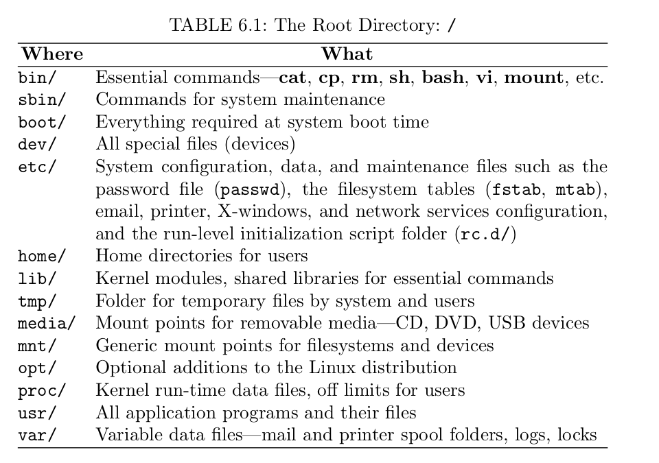
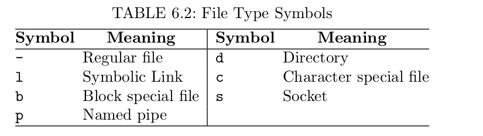

# Chapter 6 The File system
The program that creates stores, retrieves, protects, and manages files is the *file storage system*, which is part of the kernel of any modern operating system.

## File Type
The file tree contains different types of files.
1. An *ordinary file* that contains text, programs, or other data
2. A *directory* that contains names and address of other files
3. A *special file* that represents an I/O device or a filesystem partition.
4. A *symbolic link* that is a pointer to another file.
5. A *socket* that is used for inter-process communication.
6. A *named pipe* is a way for inter-process communication without the socket semantics.

The first character in an `ls -l` listing is a *file type symbol*.

