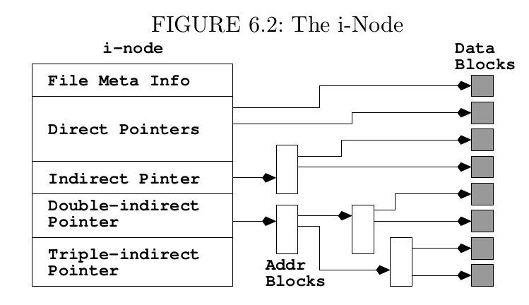
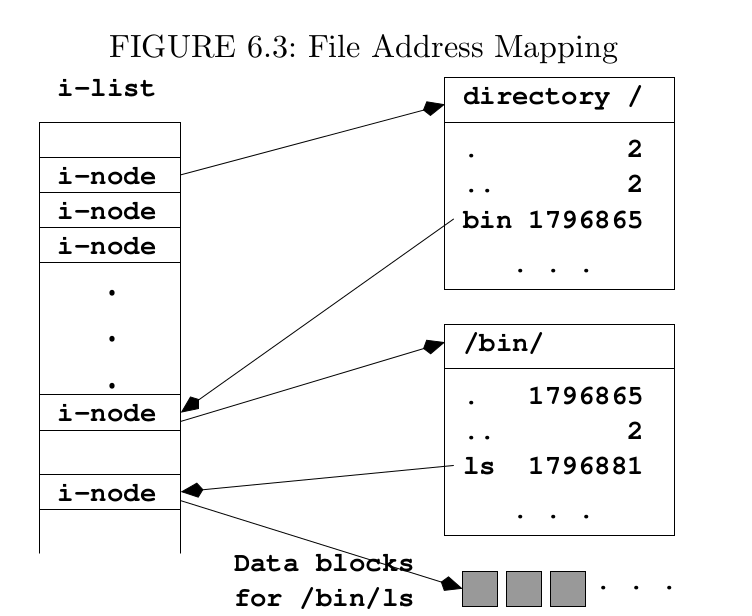

# Chapter 6 The File system
The program that creates stores, retrieves, protects, and manages files is the *file storage system*, which is part of the kernel of any modern operating system.

## File Type
The file tree contains different types of files.
1. An *ordinary file* that contains text, programs, or other data
2. A *directory* that contains names and address of other files
3. A *special file* that represents an I/O device or a filesystem partition.
4. A *symbolic link* that is a pointer to another file.
5. A *socket* that is used for inter-process communication.
6. A *named pipe* is a way for inter-process communication without the socket semantics.

The first character in an `ls -l` listing is a *file type symbol*.


## Special file
Two kinds of special files:
* *character special file*, represents a byte-oriented I/O device, such display and printer.
* *block special file*, represents a high-speed I/O device that transfers data in block (hard drive).
## links
Linux allows a directory entry to be a pointer to another file. Such as file pointer is called link. 
* *hard link*. is not distinguishable from the original file. Hard links allow you to give different names to the same file within the same file system.
	```
	ln report report.txt
	```
	By default, **ln** forms hard links.
* *symbolic link*. A symbolic link is a directory entry that contains the pathname of another file. 
	```
	ln -s filename linkname
	```
	Unlike hard link, here *filename* does not even have to be an existing file. 
## File permission
**rwx**
* For a regular file, it is easy to understand
* For a directory, execution permission for **cd** or **pwd**. read permission for **ls**. write permission for creating or deleting files in the directory.
## Default File Protection Setting: umask
When you create a new file, the system gives the file a default protection model. The Shell built-in command **umask** display the umask value. For example:
```
umask 077
```
`000111111`. Here `1` is for forbidding the permission.
## File Status
For each file in the Linux file system, a set of *file status* items is kept in the i-node of the file and is maintained by the operating system, recording the file meta information (information is used by Linux to access and manipulate the file. File status includes
* mode          16-bit integer quantity used to represent the file mode.
* number of links   total number of hard links to this file.
* owner             user identification of the owner of this file.
* group             group identification of this file.
* size              total size in bytes of the data maintained in this file.
* last access       time when this file was last read or written.
* last content change   time when the contents of the file were last modified.
* last status change    time when any status item of this file was changed
* i-number              the index number of the i-node.
* device                hardware device where the file is stored.
* block size            optimial block size to use for file I/O operations
* block count           total number of file blocks allocated to this file.

Many Linux system also implement the *Second Extended Filesystem* or an extension of it (*ext3*).

### File mode
The file mode consists of 16 bits.
* 4 high bits specify the file type.
* Next 3 bits define the manner in which an executable file is run.
* Lowest 9 bits specify the r, w, x permission for owner, group and others.

### File Userid and Groupid
By default, a new user belongs to a group with a groupid the same as the userid. If a user belongs to additional group, the affiliations are specified in the file `/etc/group`. The groupid of a file can be set to any group to which the file owner belongs.
```
chgrp groupid filename ...
chgrp research *
chown ownerid filename ...
chown -R pwang .        (changes the ownership of all files in the hierachy)
```
**-R option to process files and folders recursively**

### Establishing a group
1. create a group.
    ```
    groupadd projectx
    system-config-users projects
    ```
    Or edit `/etc/group`
2. Establish a directory **alpha**. All files in alpah are to be shared with others in **projectx**.
3. Change the groupid of alpha.
    ```
    chgrp projectx alpha
    ```
4. Set the group access permission
    ```
    chmod g=rwx alpha
    chmod g=rw alpha
    chmod g=r alpha
    ```
5. Optionally, set the restricted deletion flag for **alpha** folder.
    ```
    chmod +t alpha
    ```
6. Make sure each file in **alpha** carries the groupid projectx.

## FIle system implementation


Here is an example shows how the pathname `/bin/ls` leads from the root directory `/` to the file `ls` through a sequence of i-nodes and directory entries.




