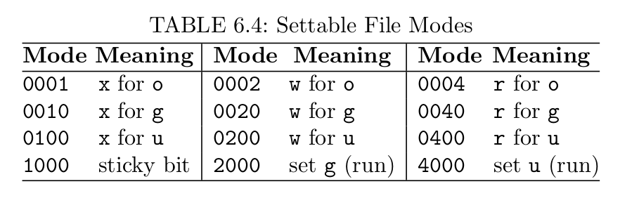

# Chapter 6 The File system
The program that creates stores, retrieves, protects, and manages files is the *file storage system*, which is part of the kernel of any modern operating system.

## File Type
The file tree contains different types of files.
1. An *ordinary file* that contains text, programs, or other data
2. A *directory* that contains names and address of other files
3. A *special file* that represents an I/O device or a filesystem partition.
4. A *symbolic link* that is a pointer to another file.
5. A *socket* that is used for inter-process communication.
6. A *named pipe* is a way for inter-process communication without the socket semantics.

The first character in an `ls -l` listing is a *file type symbol*.


## Special file
Two kinds of special files:
* *character special file*, represents a byte-oriented I/O device, such display and printer.
* *block special file*, represents a high-speed I/O device that transfers data in block (hard drive).
## links
Linux allows a directory entry to be a pointer to another file. Such as file pointer is called link. 
* *hard link*. is not distinguishable from the original file. Hard links allow you to give different names to the same file within the same file system.
	```
	ln report report.txt
	```
	By default, **ln** forms hard links.
* *symbolic link*. A symbolic link is a directory entry that contains the pathname of another file. 
	```
	ln -s filename linkname
	```
	Unlike hard link, here *filename* does not even have to be an existing file. 
## File permission
**rwx**
* For a regular file, it is easy to understand
* For a directory, execution permission for **cd** or **pwd**. read permission for **ls**. write permission for creating or deleting files in the directory.
## Default File Protection Setting: umask
When you create a new file, the system gives the file a default protection model. The Shell built-in command **umask** display the umask value. For example:
```
umask 077
```
`000111111`. Here `1` is for forbidding the permission.
## File Status
For each file in the Linux file system, a set of *file status* items is kept in the i-node of the file and is maintained by the operating system, recording the file meta information (information is used by Linux to access and manipulate the file. File status includes
* mode          16-bit integer quantity used to represent the file mode.
* number of links   total number of hard links to this file.
* owner             user identification of the owner of this file.
* group             group identification of this file.
* size              total size in bytes of the data maintained in this file.
* last access       time when this file was last read or written.
* last content change   time when the contents of the file were last modified.
* last status change    time when any status item of this file was changed
* i-number              the index number of the i-node.
* device                hardware device where the file is stored.
* block size            optimial block size to use for file I/O operations
* block count           total number of file blocks allocated to this file.

Many Linux system also implement the *Second Extended Filesystem* or an extension of it (*ext3*).

### File mode
The file mode consists of 16 bits.
* 4 high bits specify the file type.
* Next 3 bits define the manner in which an executable file is run.
* Lowest 9 bits specify the r, w, x permission for owner, group and others.

### File Userid and Groupid
By default, a new user belongs to a group with a groupid the same as the userid. If a user belongs to additional group, the affiliations are specified in the file `/etc/group`. The groupid of a file can be set to any group to which the file owner belongs.
```
chgrp groupid filename ...
chgrp research *
chown ownerid filename ...
chown -R pwang .        (changes the ownership of all files in the hierachy)
```
**-R option to process files and folders recursively**

### Establishing a group
1. create a group.
    ```
    groupadd projectx
    system-config-users projects
    ```
    Or edit `/etc/group`
2. Establish a directory **alpha**. All files in alpah are to be shared with others in **projectx**.
3. Change the groupid of alpha.
    ```
    chgrp projectx alpha
    ```
4. Set the group access permission
    ```
    chmod g=rwx alpha
    chmod g=rw alpha
    chmod g=r alpha
    ```
5. Optionally, set the restricted deletion flag for **alpha** folder.
    ```
    chmod +t alpha
    ```
6. Make sure each file in **alpha** carries the groupid projectx.

## FIle system implementation


Here is an example shows how the pathname `/bin/ls` leads from the root directory `/` to the file `ls` through a sequence of i-nodes and directory entries.


## Mounted filesystems.

The complete Linux file system may contain one or more filesystems, *root filesystem* and *mounted filesystem*.
* The location of the i-list of the root filesystems is always known to the operating system.
* A mounted filesystem is attached to the root filesystem at any directory in the root filesystem.
    ```
    mount [-r] devfile directory        (mount the filesystem stored at the block special file devfile at the given directory, -r: read-only)
    umount directory
    ```
    The directory is called the root directory of the mounted filesystems.
## find
```
find . -name \*.c -print
```
An expression is evaluated only if all preceding expressions are true. In other words, expression evaluation for the current file terminates on the first false expression, and the search process then goes on to the next file in the subtree.
* -atime n          True if the file has last been accessed in n days.
* -name pattern     True if the name the current file matches the given Glob pattern.
* -newer file       Ture if the current file has been modified more recently than the given file
* -print            Always True; causes the pathname of the current file to be displayed.
* -exec cmd args    Execute the given shell cmd and returns true if cmd returns 0 exit status, 
* -type t           True if the type the file is t, (b, c, d, f, l ,p, s)
* -user userid      True if te file belongs to the user userid
* (e1)              True if e1 is true
* !e1               True if e1 is false
* e1 e2             True if e1 and e2 are both true
* e1 -o e2          True if one of e1 and e2 are true.
## locate
```
locate gnome
locate -b \gnome
locate --regex \.html$
```
## Saving, compressing, and distributin Files
The **tar** command copies entire *directory hierachies*. The **tar** command is often used together with common file compression schemes such as **gzip** and **bzip2**.
Example
```
* tar cvf tarfile.tar name1 name2 ...
* tar zcvf tarfile.tgz name1 name2 ...
* tar jcvf tarfile.tbz name1 name2 ...
```
Then extracting command is 
```
* tar xvf tarfile.tar 
* tar zxvf tarfile.tgz 
* tar jxvf tarfile.tbz
```

The first one is to save the named file withouth compression, The second one with gzip compression, The third one bzip2 compression.
* c create tarfile
* v verbose
* f tarfile name follows
* z use gzip
* j use bzip2
### zip and unzip
```
zip -r archive.zip name1 name2 ...
```
## shar
**shar** packs all the files into a single file of *sh* commands. The packed file is unpacked by letting *sh* process the file.
## more file commands

* basename removes prefixes and suffixes from a filename.
* cmp compares two files to see if they are identitcal.
* comm selects or rejects lines common to two sorted files.
* df displays disk space free on all file systems.
* diff compares two files or directories and outputs the differences.
* du display all file sizes in kilobytes in a directory hierachy.
* size display the size of an object file
* split splits a file into pieces.
* touch updates the last modfied time of a file.
* uniq reports repeated lines in a file.
* wc counts the nubmer of words, lines in given files.
* split splits a file into pieces.
* touch updates the last modfied time of a file.
* uniq reports repeated lines in a file.
* wc counts the nubmer of words, lines in given files.
* split splits a file into pieces.
* touch updates the last modfied time of a file.
* uniq reports repeated lines in a file.
* wc counts the nubmer of words, lines in given files.
* split splits a file into pieces.
* touch updates the last modfied time of a file.
* uniq reports repeated lines in a file.
* wc counts the nubmer of words, lines in given files.
* split splits a file into pieces.
* touch updates the last modfied time of a file.
* uniq reports repeated lines in a file.
* wc counts the nubmer of words, lines in given files.
* split splits a file into pieces.
* touch updates the last modfied time of a file.
* uniq reports repeated lines in a file.
* wc counts the nubmer of words, lines in given files.
* split splits a file into pieces.
* touch updates the last modfied time of a file.
* uniq reports repeated lines in a file.
* wc counts the nubmer of words, lines in given files.
* split splits a file into pieces.
* touch updates the last modfied time of a file.
* uniq reports repeated lines in a file.
* wc counts the nubmer of words, lines in given files.
* split splits a file into pieces.
* touch updates the last modfied time of a file.
* uniq reports repeated lines in a file.
* wc counts the nubmer of words, lines in given files.
* split splits a file into pieces.
* touch updates the last modfied time of a file.
* uniq reports repeated lines in a file.
* wc counts the nubmer of words, lines in given files.
* split splits a file into pieces.
* touch updates the last modfied time of a file.
* uniq reports repeated lines in a file.
* wc counts the nubmer of words, lines in given files.
* split splits a file into pieces.
* touch updates the last modfied time of a file.
* uniq reports repeated lines in a file.
* wc counts the nubmer of words, lines in given files.
* split splits a file into pieces.
* touch updates the last modfied time of a file.
* uniq reports repeated lines in a file.
* wc counts the nubmer of words, lines in given files.
* split splits a file into pieces.
* touch updates the last modfied time of a file.
* uniq reports repeated lines in a file.
* wc counts the nubmer of words, lines in given files.
* split splits a file into pieces.
* touch updates the last modfied time of a file.
* uniq reports repeated lines in a file.
* wc counts the nubmer of words, lines in given files.
* split splits a file into pieces.
* touch updates the last modfied time of a file.
* uniq reports repeated lines in a file.
* wc counts the nubmer of words, lines in given files.
* split splits a file into pieces.
* touch updates the last modfied time of a file.
* uniq reports repeated lines in a file.
* wc counts the nubmer of words, lines in given files.
* split splits a file into pieces.
* touch updates the last modfied time of a file.
* uniq reports repeated lines in a file.
* wc counts the nubmer of words, lines in given files.
* split splits a file into pieces.
* touch updates the last modfied time of a file.
* uniq reports repeated lines in a file.
* wc counts the nubmer of words, lines in given files.
* split splits a file into pieces.
* touch updates the last modfied time of a file.
* uniq reports repeated lines in a file.
* wc counts the nubmer of words, lines in given files.
* split splits a file into pieces.
* touch updates the last modfied time of a file.
* uniq reports repeated lines in a file.
* wc counts the nubmer of words, lines in given files.
* split splits a file into pieces.
* touch updates the last modfied time of a file.
* uniq reports repeated lines in a file.
* wc counts the nubmer of words, lines in given files.
* split splits a file into pieces.
* touch updates the last modfied time of a file.
* uniq reports repeated lines in a file.
* wc counts the nubmer of words, lines in given files.
* split splits a file into pieces.
* touch updates the last modfied time of a file.
* uniq reports repeated lines in a file.
* wc counts the nubmer of words, lines in given files.
* split splits a file into pieces.
* touch updates the last modfied time of a file.
* uniq reports repeated lines in a file.
* wc counts the nubmer of words, lines in given files.
* split splits a file into pieces.
* touch updates the last modfied time of a file.
* uniq reports repeated lines in a file.
* wc counts the nubmer of words, lines in given files.
* split splits a file into pieces.
* touch updates the last modfied time of a file.
* uniq reports repeated lines in a file.
* wc counts the nubmer of words, lines in given files.
* split splits a file into pieces.
* touch updates the last modfied time of a file.
* uniq reports repeated lines in a file.
* wc counts the nubmer of words, lines in given files.
* split splits a file into pieces.
* touch updates the last modfied time of a file.
* uniq reports repeated lines in a file.
* wc counts the nubmer of words, lines in given files.
* split splits a file into pieces.
* touch updates the last modfied time of a file.
* uniq reports repeated lines in a file.
* wc counts the nubmer of words, lines in given files.
* split splits a file into pieces.
* touch updates the last modfied time of a file.
* uniq reports repeated lines in a file.
* wc counts the nubmer of words, lines in given files.
* split splits a file into pieces.
* touch updates the last modfied time of a file.
* uniq reports repeated lines in a file.
* wc counts the nubmer of words, lines in given files.
* split splits a file into pieces.
* touch updates the last modfied time of a file.
* uniq reports repeated lines in a file.
* wc counts the nubmer of words, lines in given files.
* split splits a file into pieces.
* touch updates the last modfied time of a file.
* uniq reports repeated lines in a file.
* wc counts the nubmer of words, lines in given files.
* split splits a file into pieces.
* touch updates the last modfied time of a file.
* uniq reports repeated lines in a file.
* wc counts the nubmer of words, lines in given files.
* split splits a file into pieces.
* touch updates the last modfied time of a file.
* uniq reports repeated lines in a file.
* wc counts the nubmer of words, lines in given files.
* split splits a file into pieces.
* touch updates the last modfied time of a file.
* uniq reports repeated lines in a file.
* wc counts the nubmer of words, lines in given files.
* split splits a file into pieces.
* touch updates the last modfied time of a file.
* uniq reports repeated lines in a file.
* wc counts the nubmer of words, lines in given files.
* split splits a file into pieces.
* touch updates the last modfied time of a file.
* uniq reports repeated lines in a file.
* wc counts the nubmer of words, lines in given files.
* split splits a file into pieces.
* touch updates the last modfied time of a file.
* uniq reports repeated lines in a file.
* wc counts the nubmer of words, lines in given files.
* split splits a file into pieces.
* touch updates the last modfied time of a file.
* uniq reports repeated lines in a file.
* wc counts the nubmer of words, lines in given files.
* split splits a file into pieces.
* touch updates the last modfied time of a file.
* uniq reports repeated lines in a file.
* wc counts the nubmer of words, lines in given files.
* split splits a file into pieces.
* touch updates the last modfied time of a file.
* uniq reports repeated lines in a file.
* wc counts the nubmer of words, lines in given files.
* split splits a file into pieces.
* touch updates the last modfied time of a file.
* uniq reports repeated lines in a file.
* wc counts the nubmer of words, lines in given files.
* split splits a file into pieces.
* touch updates the last modfied time of a file.
* uniq reports repeated lines in a file.
* wc counts the nubmer of words, lines in given files.
* split splits a file into pieces.
* touch updates the last modfied time of a file.
* uniq reports repeated lines in a file.
* wc counts the nubmer of words, lines in given files.
* split splits a file into pieces.
* touch updates the last modfied time of a file.
* uniq reports repeated lines in a file.
* wc counts the nubmer of words, lines in given files.
* split splits a file into pieces.
* touch updates the last modfied time of a file.
* uniq reports repeated lines in a file.
* wc counts the nubmer of words, lines in given files.
* split splits a file into pieces.
* touch updates the last modfied time of a file.
* uniq reports repeated lines in a file.
* wc counts the nubmer of words, lines in given files.
* split splits a file into pieces.
* touch updates the last modfied time of a file.
* uniq reports repeated lines in a file.
* wc counts the nubmer of words, lines in given files.
* split splits a file into pieces.
* touch updates the last modfied time of a file.
* uniq reports repeated lines in a file.
* wc counts the nubmer of words, lines in given files.
* split splits a file into pieces.
* touch updates the last modfied time of a file.
* uniq reports repeated lines in a file.
* wc counts the nubmer of words, lines in given files.
* split splits a file into pieces.
* touch updates the last modfied time of a file.
* uniq reports repeated lines in a file.
* wc counts the nubmer of words, lines in given files.
* split splits a file into pieces.
* touch updates the last modfied time of a file.
* uniq reports repeated lines in a file.
* wc counts the nubmer of words, lines in given files.
* split splits a file into pieces.
* touch updates the last modfied time of a file.
* uniq reports repeated lines in a file.
* wc counts the nubmer of words, lines in given files.
* split splits a file into pieces.
* touch updates the last modfied time of a file.
* uniq reports repeated lines in a file.
* wc counts the nubmer of words, lines in given files.
* split splits a file into pieces.
* touch updates the last modfied time of a file.
* uniq reports repeated lines in a file.
* wc counts the nubmer of words, lines in given files.
* split splits a file into pieces.
* touch updates the last modfied time of a file.
* uniq reports repeated lines in a file.
* wc counts the nubmer of words, lines in given files.
* split splits a file into pieces.
* touch updates the last modfied time of a file.
* uniq reports repeated lines in a file.
* wc counts the nubmer of words, lines in given files.
* split splits a file into pieces.
* touch updates the last modfied time of a file.
* uniq reports repeated lines in a file.
* wc counts the nubmer of words, lines in given files.
* split splits a file into pieces.
* touch updates the last modfied time of a file.
* uniq reports repeated lines in a file.
* wc counts the nubmer of words, lines in given files.
* split splits a file into pieces.
* touch updates the last modfied time of a file.
* uniq reports repeated lines in a file.
* wc counts the nubmer of words, lines in given files.
* split splits a file into pieces.
* touch updates the last modfied time of a file.
* uniq reports repeated lines in a file.
* wc counts the nubmer of words, lines in given files.
* split splits a file into pieces.
* touch updates the last modfied time of a file.
* uniq reports repeated lines in a file.
* wc counts the nubmer of words, lines in given files.
* split splits a file into pieces.
* touch updates the last modfied time of a file.
* uniq reports repeated lines in a file.
* wc counts the nubmer of words, lines in given files.
* split splits a file into pieces.
* touch updates the last modfied time of a file.
* uniq reports repeated lines in a file.
* wc counts the nubmer of words, lines in given files.
* split splits a file into pieces.
* touch updates the last modfied time of a file.
* uniq reports repeated lines in a file.
* wc counts the nubmer of words, lines in given files.
* split splits a file into pieces.
* touch updates the last modfied time of a file.
* uniq reports repeated lines in a file.
* wc counts the nubmer of words, lines in given files.
* split splits a file into pieces.
* touch updates the last modfied time of a file.
* uniq reports repeated lines in a file.
* wc counts the nubmer of words, lines in given files.
* split splits a file into pieces.
* touch updates the last modfied time of a file.
* uniq reports repeated lines in a file.
* wc counts the nubmer of words, lines in given files.
* split splits a file into pieces.
* touch updates the last modfied time of a file.
* uniq reports repeated lines in a file.
* wc counts the nubmer of words, lines in given files.
* split splits a file into pieces.
* touch updates the last modfied time of a file.
* uniq reports repeated lines in a file.
* wc counts the nubmer of words, lines in given files.
* split splits a file into pieces.
* touch updates the last modfied time of a file.
* uniq reports repeated lines in a file.
* wc counts the nubmer of words, lines in given files.
* split splits a file into pieces.
* touch updates the last modfied time of a file.
* uniq reports repeated lines in a file.
* wc counts the nubmer of words, lines in given files.
* split splits a file into pieces.
* touch updates the last modfied time of a file.
* uniq reports repeated lines in a file.
* wc counts the nubmer of words, lines in given files.
* split splits a file into pieces.
* touch updates the last modfied time of a file.
* uniq reports repeated lines in a file.
* wc counts the nubmer of words, lines in given files.
* split splits a file into pieces.
* touch updates the last modfied time of a file.
* uniq reports repeated lines in a file.
* wc counts the nubmer of words, lines in given files.
* split splits a file into pieces.
* touch updates the last modfied time of a file.
* uniq reports repeated lines in a file.
* wc counts the nubmer of words, lines in given files.
* split splits a file into pieces.
* touch updates the last modfied time of a file.
* uniq reports repeated lines in a file.
* wc counts the nubmer of words, lines in given files.
* split splits a file into pieces.
* touch updates the last modfied time of a file.
* uniq reports repeated lines in a file.
* wc counts the nubmer of words, lines in given files.
* split splits a file into pieces.
* touch updates the last modfied time of a file.
* uniq reports repeated lines in a file.
* wc counts the nubmer of words, lines in given files.
* split splits a file into pieces.
* touch updates the last modfied time of a file.
* uniq reports repeated lines in a file.
* wc counts the nubmer of words, lines in given files.
* split splits a file into pieces.
* touch updates the last modfied time of a file.
* uniq reports repeated lines in a file.
* wc counts the nubmer of words, lines in given files.
* split splits a file into pieces.
* touch updates the last modfied time of a file.
* uniq reports repeated lines in a file.
* wc counts the nubmer of words, lines in given files.
* split splits a file into pieces.
* touch updates the last modfied time of a file.
* uniq reports repeated lines in a file.
* wc counts the nubmer of words, lines in given files.
* split splits a file into pieces.
* touch updates the last modfied time of a file.
* uniq reports repeated lines in a file.
* wc counts the nubmer of words, lines in given files.
* split splits a file into pieces.
* touch updates the last modfied time of a file.
* uniq reports repeated lines in a file.
* wc counts the nubmer of words, lines in given files.
* split splits a file into pieces.
* touch updates the last modfied time of a file.
* uniq reports repeated lines in a file.
* wc counts the nubmer of words, lines in given files.

