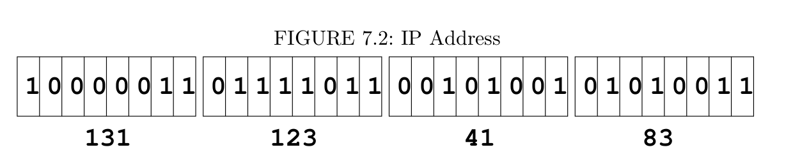

# Chapter 7 Network
## network address (IP)
An internet address is represented by 4 bytes in a 32-bit quantity. (For example, 131.123.41.83)

Every host on the internet has its own network address. Each host may also has a *domain name* composed of words, rather than a postal address.

