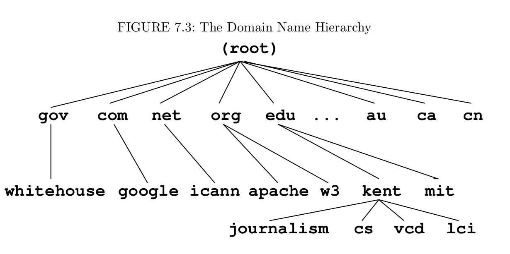

# Chapter 7 Network
## network address (IP)
An internet address is represented by 4 bytes in a 32-bit quantity. (For example, 131.123.41.83)

Every host on the internet has its own network address. Each host may also has a *domain name* composed of words, rather than a postal address.
`host` displays the IP and domain name of any given host.



For example:
```
monkey.cs.kent.edu
```
The address for `monkey` puts in the `cs` local domain, within the `kent` subdomain, which is under `edu` the top-level domaiFor example:
```
monkey.cs.kent.edu
```
The address for `monkey` puts in the `cs` local domain, within the `kent` subdomain, which is under `edu` the top-level domain. Other top level domains
* org nonprofit organizations
* gov US govenment office
* mil US military installation
* com commerical outfits
* net network service provider
* uk united kingdom
* cn China
With in a local domain (`cs.kent.edu`), you can refer matchines by their hostname alone. (For example `monkey`, `dragon`, `tiger`)
**In fact, a domain name is first translated to a numerical IP address before being used**

## client and server
* server: A server process provides a specific service on a host machine, such as SMTP, SSH, SFTP and HTTP. (`/etc/services` list all the port information)
* clint: A clint process on a host connects with a server on another host to obtain its service. Thus, a client program is the agent through which a particular network service can be obtained.
## Domain network system
The *domain network system* (DNS) is a network service that supports dynamic update and retrieval of information contained in the distributed name space. A network client program (for example, Firefox browser) will normally use the DNS to obtain IP address information.


`id_rsa` is private key (your identity), `id_rsa.pub` is public key.

## remote file synchronization
```
rsync -az userid@host:source destDir        (remote to local sync)
rsynn -za soure usrid@host:destDir          (local to remote sync)
```
```
rsync -az pwang@monkey.cs.kent.edu:~/linux book ~/projects/
```
Updates the local folder ~/projects/linux\_book, based on the remote folder ~/linux\_book by loging in as pwang on the remote host....


