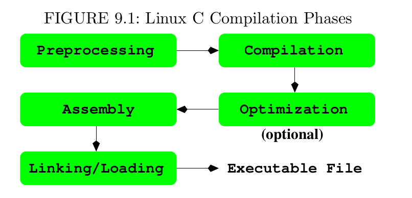
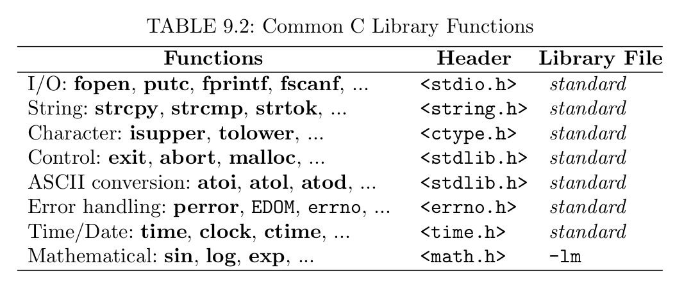

# C Programming in Linux
## command line arguments
```
int main(int argc, char *argv[])
{
}
```
`char \*argvp[]` declares the formal array parameter `argv`.
* argc-----The number of command-line arguments, including the command name
* argv-----A pointer to the nth command line arguments.

### Exit status

EXIT\_SUCCESS (0 on linux is normal), while EXIT\_FAILURE (1 on linux), or any other small positive integers indicates abnormal termination.  ($?)

### Compile and execute
```
gcc echo.c -o myecho
```
**gcc** runs the GNU C Compiler.

## Linux command argument conventions
Generally speaking, linux commands use the following convention for specifying arguments:
```
command [ options ] [ files ]
```
Options are given with a single or double hyphen (-) prefix.
```
-char
--word
```
where char is a single letter and word is a full word. For example, `ls` has the single-letter `-F` and the full word `--classify`. A command may take zero or more options. When giving more than one options, the single-letter options sometimes can be combined by preceding them with a single -.
```
ls -l -g -F
ls -lgF
```
Some commands such as `ps` and `tar` use options, but do not require a leading hyphen.


1. Preprocessing
2. Compilation
3. Optimization
4. Assembly
5. Linking

### Options for gcc
* -E performs preprocessing only
* -S produces assembl code files (.s)
* -c produces object files (.o).
* -g or -ggdb   debugging information
* -o    names the executable files
* -O, -O2, -O3      Activate
* -llibname     specifies libname as a library file to use when linking
* -Ldir         add dir to the library search path.
* -std=standard Uses the given standar for C
* -v        Display the names and arguments
* -Dname    Initializes the **cpp** macro name to the given string. This is equivalent to insert `#define` at the beginning of a source file.
* -Idir add the directory dir to the directory list that **gcc** searches for `#include`
* -pg Prepares to generate an execute profile to be used with the Linux **gprof** utilityl.

### The C proprocessor
Directive to the C preprocessor begin with the character # in column one.
```
#include
```
```
#define MIN(x,y) ((x) >(y) ? (y): (x))
#undef ..
```

### Preventing multiple loading of header files.

* -l*name*      loads the library file lib*name*.a. Where *name* is a character string. The loader finds library files in standard system directories (`/lib`, `/usr/lib` and `/usr/local/lib`). Additional directory specified by the -L option
* -L*dir*       Adds the directory *dir* in front of the list of directories to find library files.
* -o *name*     Uses the given *name* for the executable file.
## The C LIbrary

I/O to Files
```
FILE *fopen(char *filename, char *access_mode)
```

The command **ar** is used to create and maintain library and archives. The general form of the **ar** command is 
```
ar key [ position ] archive-name file ...
```
The name of an archive file normally uses the .a suffix.
